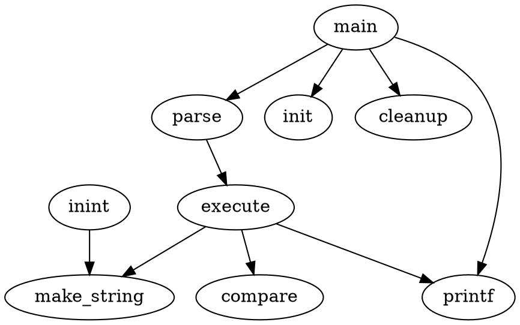
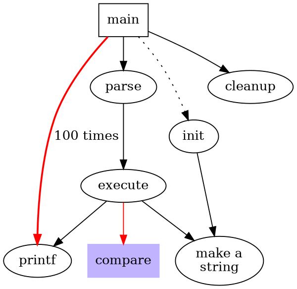
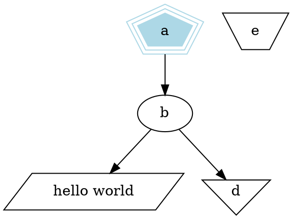
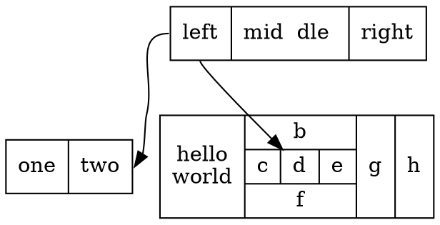

## 基于 Dot 绘图（Drawing graphs with dot）

### 摘要

### 1 基本图形绘制（Basic Graph Drawing）

*dot*可以绘制有向图。读取带有属性的 graph 文本文件，然后进行绘制或生成 graph 文件或者一些图片格式（像是 GIF、PNG、SVG、PDF、PostScript）

*dot*绘制图形主要有四个步骤。了解这些有助于你理解*dot*生成了哪种布局和你如何去控制。*dot*使用的布局程序依赖于无环图。因此，第一步就是通过反转某些环中边的方向来打破输入图中的环。第二步就是赋予结点不同的等级或级别。在一个从上到下的图形绘制中，等级决定了 Y 轴方向的坐标。跨越一个等级以上的边将会被分成由“虚拟结点”和单位长度所组成的链。第三步就是对等级内的结点进行排序以防边交叉。第四步就是设置结点 X 轴方向的坐标，以保持边尽可能短，最后边绘制为样条线。这些与大多数分层图形绘制程序相同的通用步骤，是基于 Warfield [War77], Carpano [Car80] and Sugiyama [STT81]的工作。我们建议读者阅读[GKNV93]，以详细了解*dot*的算法。

*dot*接受*DOT*语言输入（参考附录 D），该语言描述了三种主要类型的对象：图、结点和边。最外层的图可以是有向图（digraph）或无向图。因为*dot*是有向图的布局，所以下列示例均采用有向图（单独的布局工具，neato，可以绘制无向图[Nor92]），在一个图里，也可以使用*subgraph*定义包含结点和边的子集。

图 1 是一个*DOT*语言示例。第一行给出了图的名称和类型。接下来的代码创建结点、边和子图，然后设置属性。这些对象的命名可以是 C 语言标识符，数字或者 C 字符串，引号包围标点和空白符。



图 1


图 2

文件中结点名第一次出现是就会被创建。当使用边操作符 _->_ 连接结点时，边就会创建。在示例中，第二行创建了一条从*main*到*parse*，从*parse*到*exectue*的边。执行*dot*命令
（文件名为 graph1.gv）

```bash
$ dot -Tps graph1.gv -o graph1.ps
```

然后会生成图 2。命令行选项-Tps 选择 PostScript（EPSF）格式作为输出，graph1.ps 可以被打印，通过 PostScript 查看程序显示出来，或者插入到其他文档中。

在布局中调整结点和变得表达或者放置是非常有用的。可以通过设置文件中结点、边和子图的属性实现。属性是名称-值的字符串。图 3 图 4 展示了一些布局的属性。在图 3 的列表中，第 2 行设置了图的大小为 4x4 英寸。这个属性控制了绘图的尺寸，如果绘制尺寸太大，会均匀缩放到合适大小。

结点或边的属性可以在方括号中设置。在第三行，main 结点的形状被设置为 box。第四行中，通过增加边的权重（默认是 1）将其拉直。第六行绘制了一条虚线边。第八行将 execute 指向 make_string 和 printf 结点。第 10 行将边的默认颜色设置为红色。在此之后创建的边都将收到影响。第 11 行将边设为粗体，并添加标记 100 times。第 12 行为 make_string 结点设置了多行标注。第 13 行改变了结点的默认样式为填充蓝色的 box。结点 compare 继承了这些设置。



图 3


图 4

### 2 绘制属性（Drawing Attributes）

影响 graph 绘制的主要属性在附录 ABC 中进行总结。更多的属性和更详尽的描述可以参考[Graphviz](https://www.graphviz.org/)网站，尤其是
[http://www.graphviz.org/doc/info/attrs.html](http://www.graphviz.org/doc/info/attrs.html)

#### 2.1 结点形状（Node Shapes）

默认情况下，结点是以`shape=ellipse, width=.75, height=.5`绘制，并以结点名称作为标注。其它常用的形状包括框、圆、记录和纯文本。附录 H 给出了包括主要结点形状的列表。纯文本是比较特殊的，因为它没有任何外边框。在某些类型的图中这是很重要的。在主要关注图形结构的情况下，特别是图形是中等大小，点形状会减少结点显示最少的内容。当绘制时，结点的实际大小是所设置的尺寸和文本标注所需要的尺寸中较大的那个。除非设置`fixedsize=true`，这种情况下强制使用宽高值。

结点形状主要分为两大类，基于`polygon`的和基于`record`的。除了 record 和 Mrecord 之外的所有结点形状均视为多边形，并通过边的数量（椭圆和圆视为特殊情况）和一些几何属性进行建模。其中有一些属性可以在图形中指定。如果设置`regular=true`，结点就被强制设置为正方形，参数`peripheries`设置绘制的边界曲线的数量。例如，双圆设置`peripheries=2`，`orientation`属性设置多边形按顺时针旋转，以度为单位。

形状`polygon`暴露了所有多边形参数，对于创建许多未预定义的形状很有用。 除了上面提到的`regular`、`peripheries`、`orientation`规则外，多边形还通过边数`sides`、`skew`和`distortion`等参数化。 `skew`是一个浮点数（通常在-1.0 到 1.0 之间），它通过从上到下倾斜形状来扭曲形状，正值是将多边形的顶部向右移动。 因此，可以使用`skew`将方形变成平行四边形。 `distortion`使多边形从顶部到底部缩小，负值会导致底部大于顶部。 `distortion`会使盒子变成梯形。 图 6 和 5 展示了多边形这些属性。

基于`record`的结点形成另一类结点形状。 这些包括`record`和`Mrecord`。 除了后者是圆角外，两者相同。 这些结点表示字段的递归列表，这些递归列表绘制为交替排列的水平和垂直框。 递归结构由结点的`label`属性确定，标签具有以下架构：

```dot
rlabel -> field('|'field)*
field  -> boxLabel|'' rlabel ''
boxLabel -> ['<' string '>'][string]
```

大括号、竖线和尖括号必须转义。 空格被解释为标记之间的分隔符，因此，如果要在文本中逐字显示空格，必须将其转义。 *boxLabel*中的第一个字符串为该字段命名，并用作该盒子的端口名（请参阅第 3.1 节）。 第二个字符串用作该字段的标注； 它可能包含与多行标签相同的转义序列（请参阅第 2.2 节）。 图 7 和 8 的示例说明了`record`的用法和某些属性。



图 5


图 6



图 7


图 8

#### 2.2 标注（Labels）

如上所述，默认结点标签是其名称。 默认情况下边是不标记的。 可以使用 label 属性显式设置结点和边的标注，如图 4 所示。

尽管使用名称标记结点可能很方便，但有时必须显式设置标注。 例如，在绘制文件目录树时，一个目录可能有多个名为 src 的目录，但是每个必须具有唯一的结点标识符。inode 值或者全路径名适合作为唯一标识。然后可以在目录内用文件名标注每个结点。

多行标注可以使用转义字符`\n`、`\l`和`\r`创建，以打断居中、左对齐或右对齐的行。

图或者子图也可以有标注。图标注默认是在底部居中。设置`labelloc=t`使标注顶部居中。子图标签显示在左上角的封闭矩形内。 设置`labelloc=b`将标签移动到矩形的底部。 设置`labeljust=r`将标签移到右边。

默认字体是黑色 14 号 Times-Roman。可以使用属性`fontname`、`fontsize`和`fontcolor`设置其他字体、大小和颜色。 字体名称应与目标解释器兼容。 最好仅使用标准字体系列 Times、Helvetica、Courier 或 Symbol，因为它们可以与任何目标图形语言一起使用。 例如，Times-Italic，Times-Bold 和 Courier 是便携式的； AvanteGarde-DemiOblique 不是。

对于位图输出（例如 GIF 或 JPG），*dot*依赖于在布局期间使这些字体可用。 Graphviz 的大多数预编译安装都使用 fontconfig 库将字体名称与可用字体文件进行匹配。 fontconfig 带有一组实用程序，用于显示匹配项和安装的字体。 请参考 font-config 文档，或 Graphviz FontFAQ 或更多详细信息。 如果*Graphviz*是在没有 fontconfig 的情况下构建的（通常意味着您是自己从源代码编译的），则 fontpath 属性可以指定搜索字体文件的路径。如果未设置，*dot*将使用 DOTFONTPATH 环境变量，仍没有的话将使用 GDFONTPATH 环境变量。 如果都没有，则*dot*将使用内置列表。

边的标注位于边中心附近。通常，要注意防止边标注压盖边和结点。 在复杂的图中，确定标签属于哪个边仍是非常困难的。 如果`decorate`属性设置为 true，将会绘制一条连接标签和边的线。 有时，为避免在边标注和边之间发生碰撞，图形会变得更大。 如果设置`labelfloat=true`，则*dot*不会试图防止重叠，从而使绘图更紧凑。

边还可以使用`headlabel`和`taillabel`设置其它标注，这些标注放置在边的端点附近。 这些标注可以使用`labelfontname`、`labelfontsize`和`labelfontcolor`设置属性。 这些标注放置在边和结点的交点附近，因此可能会影响它们。 为调整图形，用户可以设置`labelangle`和`labeldistance`属性。 前者设置角度（以度为单位），标注从边与结点的入射角开始旋转。 后者设置乘法比例因子，以调整标注到结点的距离。

#### 类 Html 标注（HTML-like Labels）

为了在更小粒度上使用更丰富的属性集合，*dot*使用 HTML 语法生成类 HTML 的标注。 这些使用由<...>分隔的字符串，而不是双引号。 在分隔符之间，字符串必须遵循 HTML 的词汇、引号和句法惯例。
通过使用`<TABLE>`元素，可以将这些标签视为`shape=record`的扩展和替代。 有了这些，就可以在框形级别去更改颜色和字体，还可以加入图片。`<TD>`元素的 PORT 属性提供单元的端口名称（请参阅第 3.1 节）。

尽管类 HTML 标注只是标注属性的一种特殊类型，但人们经常使用它们，就像它们是类似于`record`的一种新结点形状。因此，当使用它们时，通常会看到`shape=none`和`margin=0`。还要注意，作为标注，它们可以与边、图以及结点一起使用。

图 9 和 10 给出了使用类 HTML 标注的示例。

```dot
digraph html {
    abc [shape=none, margin=0, label=<
                                <TABLE BORDER="0" CELLBORDER="1" CELLSPACING="0" CELLPADDING="4">
                                    <TR>
                                        <TD ROWSPAN="3"><FONT COLOR="red">hello</FONT><BR/>world</TD>
                                        <TD COLSPAN="3">b</TD>
                                        <TD ROWSPAN="3" BGCOLOR="lightgrey">g</TD>
                                        <TD ROWSPAN="3">h</TD>
                                    </TR>
                                    <TR>
                                        <TD>c</TD>
                                        <TD PORT="here">d</TD>
                                        <TD>e</TD>
                                    </TR>
                                    <TR>
                                        <TD COLSPAN="3">f</TD>
                                    </TR>
                                </TABLE>
                            >];
 }
```



图 9


图 10

#### 2.4 图形样式（Graphics Styles）

结点和边默认颜色为黑色，可以指定`color`属性，这是用于绘制结点形状或边的颜色。 `color`值可以是色相-饱和度-亮度三元组（三个 0 到 1 之间的浮点数，以逗号分隔）； 附录 J 中列出的一种颜色名称（从某些版本的 X window system 中借用）； 或红绿蓝（RGB）三元组（00 和 FF 之间的三个十六进制数字，以“＃”开始）。 因此，值“orchid”、“ 0.8396,0.4862,0.8549”和“＃DA70D6”是指定相同颜色的三种不同方式。 数字形式对于自动生成颜色的脚本或工具很方便。 颜色名称查找不区分大小写，并且会忽略非字母数字字符，因此，warmgrey 和 Warm_Grey 是等效的。

关于绘图中颜色使用的一些提示。 首先，避免使用太多鲜艳的色彩。 “彩虹效应”令人困惑。 最好选择较窄的颜色范围，或让饱和度者随色相变化。 第二，当结点填充有深色或非常饱和的颜色时，使用`fontcolor=white`和`fontname=Helvetica`似乎更具可读性（我们还有用于*dot
*的 PostScript 函数，这些函数可从纯字体创建轮廓字体）。第三，在某些输出格式中，您可以定义自己的色彩空间。 例如，如果使用 PostScript 进行输出，则可以在库文件中重新定义`nodecolor`，`edgecolo`r 或`graphcolor`。 因此，要使用 RGB 颜色，请将以下行放置在文件 lib.ps 中。

`/nodecolor {setrgbcolor} bind def`

使用 `-l` 命令行选项加载这个文件。

`dot -Tps -l lib.ps file.gv -o file.ps`

`style`属性控制结点和边的其它图形特征。 此属性是逗号分隔的、带有可选参数列表。 预定义的包括`solid,dashed,dotted,bold`和`invis`。 前四个控制结点的边界和边具有明显的意义。 值 `invis`效果是不绘制。 结点的样式还可以包括`filled,diagonals`和`rounded`。`filled`属性 用`fillcolor`在结点内填充阴影。 如果`fillcolor`未设置，则使用`color`。 如果仍未设置，则默认使用浅灰色。`diagonals`样式会在靠近顶点的两对边之间绘制短对角线。`rounded`样式绘制圆角多边形。

用户定义的样式原语可以通过自定义 PostScript 函数实现。在绘制任何标记之前，在图、结点或边的 gsave 上下文内执行这类原语。 参数列表将转换为 PostScript 标识。 例如，设置`style="setlinewidth(8)"`将绘制带有粗轮廓的结点。 其中，`setlinewidth`是 PostScript 内置的，但是用户定义的 PostScript 函数可以用相同的方式调用。 这些函数的定义通过使用`-l`加载库文件中给出。

边通过`dir`属性设置箭头。`dir`可以是`forward`（默认）、`back`、`both`或`none`。这些仅仅指绘制箭头的位置，并且不更改基础图形。例如，设置`dir=back`会使箭头在边的尾部绘制，而头部没有，但是不会交换边的首尾端点。属性`arrowhead`和`arrowtail`指定箭头的样式（如果有的话），该样式在边的首尾断点使用。样式值为`normal`、`inv`、`dot`、`invdot`、`odot`、`invodot` 和 `none`（参见附录 I）。属性`arrowize`指定一个乘法因子，影响边上绘制的任何箭头大小。例如，`arrowize=2.0` 使箭头长宽变为两倍。

在样式和颜色方面，子图的行为与框形结点类似，就像一个大点的多边形，使用子图的`color`属性绘制子图边界，一般来说，子图的样式受`style`、`color`和`fillcolor`属性影响。

如果顶层图指定了`bgcolor`属性，则此颜色将用作整个图形的背景，也会作为默认的填充颜色。

#### 2.5 绘制的方向、大小和空间（Drawing Orientation, Size and Spacing）

*dot*绘图时`nodeep`和`ranksep`属性对大小起重要作用。 第一个参数指定在同一层级级上，两个相邻结点之间的最小距离（以英寸为单位）。 第二个涉及层级分离，这是某一等级结点的底部与下一等级的结点顶部之间的最小垂直距离。`ranksep`属性以英寸为单位设置层级分离。也可以设置`ranksep=equally`，这样可以保证以相邻层级上的中心结点为锚点，所有层级都是等距分布。 在这种情况下，两个层级之间的至少具有默认的层级间距。`ranksep`的两种用法是独立的，因此两者可以同时设置。如，`ranksep="1.0 equally"`将会等距分布，最小间距为 1 英寸。

通常，使用默认结点尺寸和间距绘制的图形，对于目标打印机或文档中所允许的空间而言太大了。有几种方法可以尝试解决此问题。首先，我们将看一下*dot*如何计算最终布局尺寸。

首先，使用默认设置，在内部以其"natural"尺寸初始化布局（除非设置`ratio=compress`）。图形的大小或纵横比没有限制，因此，如果图形很大，则布局也很大。如果您未设置`size`或`ratio`，则最终将打印自然尺寸布局。

控制图形输出尺寸的最简单方法是在图形文件中（或在命令行中使用`-G`）设置`size="x,y"`，这决定了最终布局的大小。例如，无论初始布局有多大，`size="7.5,10"`填充 8.5x11 页面（假设页面方向默认）非常合适。

比率也会影响布局大小。根据大小和比例的设置，有很多情况。

情况 1. `ratio`没有设置。如果图形已经适合给定的`size`，那什么也不会发生。 否则，图形将均匀缩小到合适的尺寸。

如果`ratio`设置了，有四种情况。

情况 2a. 如果`ratio=x`，其中`x`是浮点数，绘制将按某一边缩放，以实现 ratio 所表示的按*height/width*的比例进行绘制的要求。例如，`ratio=2.0` 使图形的高度是其宽度的两倍。然后，如案例 1 所示，再使用`size`缩放布局。

情况 2b. 如果设置了`ratio=fill`和`size=x,y`，图形将某一边按`y/x`的比例进行绘制，然后再按情况 1 进行调整。结果是由`size`指定的边界框都被填充。

情况 2c. 如果设置了`ratio=compress`和`size=x,y`，则初始布局就会被压缩以适应给定的边界框。为了让布局更紧凑，就需要权衡布局质量、平衡性和对称性。然后按情况 1 调整。

情况 2d. 如果设置`ratio=auto`和`page`属性，并且图形不能在单个页面上绘制，那么`size`将忽略，*dot*将会计算一个“理想”的`size`。某一边的尺寸将会是该边上页面大小（至少是当前尺寸的一半）的最小整数倍，。然后，将两条边分别缩放为新的大小。

如果设置了`rotate=90`或`orientation=landscape`，图形将旋转 90° 进入横向模式。布局的 X 轴将沿着每页的 Y 轴。这不会影响`size`，`ratio`或`page`属性。

此时，如果未设置`page`，则最终布局将生成为一页。

如果设置`page=x,y`，则将布局打印为可以平铺或镶嵌的页面序列。通常设置为`page="8.5,11"`或`"page="11,17"`。这些值是指物理设备的完整大小。实际使用的面积将减去边距（对于打印机输出，默认值为 0.5 英寸；对于位图输出，X 和 Y 边距分别为 10 点和 2 点）。对于平铺式布局，设置较小的边距可能会有所帮助,可以通过设置`margin`属性实现。可以使用一个数字设置两个边距，也可以采用两个数字（用逗号分隔）分别设置 x 和 y 边距，单位也是英寸。尽管可以设置`margin=0`，但遗憾的是许多位图打印机都有一个无法更改的硬件内部的边距。

页面的打印顺序可以由`pagedir`属性控制。输出始终使用基于行或基于列的顺序来完成，`pagedir`是两个字母的代码，以指定主要方向和次要方向。例如，默认值为 BL，指定从下到上（B）为主要顺序和从左到右（L）为次要顺序。因此，页面最底部的一行先从左向右打印，然后从左到右打印第二行，直到从左到右打印第一行，然后结束。`T`指定从上到下的顺序，`R`表示从右到左。

如果设置了`center=true`且，page`没有设置，图形可以在默认页面尺寸（8.5x11）输出，图形将在页面居中显示。

一个常见的问题是，以小尺寸绘制的较大图形时，结点的标注可读性不高。可以通过一些设置增大标注。一个页面上可以容纳的可读文本的数量是有限的。通常，您可以在运行*dot*程序之前，从原始图形中提取一些重要的部分来绘制较小的图形。这里有一些工具可以提供帮助。

**sccmap** 将图形分解成具有强连接的组件

**tred** 计算可传递性（移除可以通过传递的边）

**gvpr** 选择结点或边，组合或移除图形剩余部分

**unflatten** 通过错开叶子结点边的长度来改进树的长宽比

还可以可以尝试在图中做一些设置：

1. 增加结点的`fontsize`。
2. 使用更小的`ranksep`和`nodesep`。
3. 使用`ratio=auto`。
4. 使用`ratio=compress`并设置一个合理的`size`。
5. 精简后，无衬线字体更易读。

#### 2.6 结点和边放置（Node and Edge Placement）

\*do t 的属性提供了许多方法调整结点和边的大尺度布局，也可以微调图形以满足用户的需要。本节将讨论这些属性。

有时，边从左到右比从上到下指向更加自然。如果顶层图形中的`rankdir=LR`，就会以从左到右的方式布局。 TB（从上到下）是默认设置。`rankdir=BT`模式可以绘制向上的图形。为完整起见，也可以用`rankdir=RL`。

在带有时间线的图形中，或强调源结点和汇聚结点的图形中，您可能需要限制等级分配。设置子图的等级可以设置为`same`、`min`、`source`、`max`、`sink`。`same`值会导致子图中所有的结点都有相同的等级。如果设置为`min`，则子图中的所有结点至少和布局中的任何其他结点一样小。设置`rank=source`，会强制子图中的结点严格小于任何其他结点的等级（设置了`min`或`source`的子图中的结点除外）。`max`或`sink`值对最大等级来说起类似作用。注意，这些约束会导致结点的等价类。如果一个子图强制结点 A 和 B 处于同一等级，而另一子图强制结点 C 和 B 共享一个等级，则两个子图中的所有结点都将绘制在同一等级上。图 11 和图 12 说明了使用子图来控制等级分配。

在某些图中，结点从左到右的顺序很重要。如果子图设置`ordering=out`，则子图中具有相同尾结点的边将按照其创建顺序从左向右散开（注意，涉及头结点的平坦边可能会干扰其顺序）。

有许多方法可以微调结点和边的布局。例如，如果一条边的结点都具有相同的`group`属性，则*dot*将尽量使该边保持笔直，并避免其他边穿过它。边的`weight`提供了另一种保持边笔直的方法。边的`weight`表明边的重要性。因此，`weight`越大，其结点就应该越靠近在一起。*dot*将权重较大的边绘制得更短更直。

当结点被约束到相同等级时，边缘权重也起作用。这些结点之间权重非零的边尽可能沿同一方向（在旋转的图形中从左到右或从上到下）跨等级排列。利用这一点，然后通过在需要的地方放置不可见的边（`style="invis"`），就可以调整结点的顺序。

可以使用`samehead`和`sametail`属性约束与同一结点相邻的边缘的端点。具体来说，具有相同头结点和相同`samehead`值的的所有边，都被约束为与头结点在同一点相交。尾结点和`sametail`效果类似。

在等级分配期间，边的头结点比尾结点等级更高。但如果边设置`constraint=false`，则不执行此要求。

在某些情况下，用户可能希望边的端点不要太靠近。这可以通过设置边的`minlen`属性实现。这定义了头和尾的等级之间的最小差异。例如，如果`minlen=2`，则在头和尾之间始终至少有一个等级。注意，这与两个结点之间的几何距离无关。

微调应谨慎。对单个结点和边的位置没有太多“帮助”或干扰时，*dot*布局效果最佳。可以通过增加某些边的`weight`，使用`style=`invis`创建不可见的边或结点，有时甚至通过重新排列文件中结点和边缘的顺序来，对布局进行一些调整。但这会适得其反，因为布局对于输入图形的变化不一定是保持不变的。最后的调整可能会使之前的所有更改无效，并导致绘制效果很差。我们预想的未来项目是将*dot*的基于数学布局技术与允许用户定义提示和约束的交互式前端结合起来。

图 11

图 12

### 3 高级特性（Advanced Features）

#### 3.1 结点端口（Node Ports）

结点端口是边可以附着到结点的位置（当一条边不是连接到端口时，它将对准结点的中心，并且将边修剪到结点的边界）。

有两种类型的端口。可以为任何结点指定基于 8 个罗盘点`"n"`、`"ne"`、`"e"`、`"se"`、`"s"`、`"sw"`、`"w"`或`"nw"`的端口，然后将边的末端将会对准结点上的该位置。因此，如果指定了`se`端口，则边将连接到结点的东南角。

另外，`record`类型的结点可以使用记录结构来定义端口，而有类 HTML 标注的表可以使用`<TD>`元素的`PORT` 属性将任何单元格设置为端口。如果记录框或表单元格定义了端口名称，则边缘可以使用该端口名称来指示它应对准的结点框的中心（默认情况下，边缘会被裁剪到框的边界）。

有两种指定端口的方法。 一种方法是使用边的`headport`和`tailport`属性，例如

```
a -> b [tailport=se]
```

或者，可以使用语法*node name:port name*将端口名用作边声明的一部分来修改结点名。 因此，上述示例也可以写成：

```
a -> b:se
```

由于`record`结点的框也有自己的角，因此可以记录名端口上接着添加罗盘端口。 因此，边

```
a -> b:f0:se
```

将连接到`record`节点`b`中端口名称为 f0 的框的东南角。

图 13 说明了记录`record`结点中端口名称的声明和使用，其结果如图 14 所示。

图 15 和 16 给出了使用`record`结点和端口的另一个示例。 与图 7 和 8 的示例结果相同，但现在使用端口作为边的连接器。注意，如果将`record`的输入高度设置为较小的值，则实际大小由文本标注决定，`record`看起来会更美观，如图 13 所示。否则，假定使用默认的节点大小（.75 x .5），如图 16 所示。图 17 和 18 是一个哈希表示例，从左到右绘制布局。

#### 3.2 簇（Clusters）

簇就是子图，置于其自己的矩形布局框内。如果子图的名称有`cluster`前缀，子图将被识别为簇（如果顶层图设置`clusterrank=none`，此特性会关闭）。可以像设置顶层图一样， 设置标注、字体特性和`labelloc`属性，尽管默认情况下簇标注会显示在图上方。对于簇来说，标注默认左对齐；设置`labeljust="r"`，标签会右对齐。`color`属性指定封闭矩形框的颜色。当设置`style="filled"`时，可以用`fillcolor`指定的颜色填充矩形框（没有`fillcolor`就使用`color`属性）。

簇是通过递归进行绘制，不断计算簇内节点的等级分配和内部排序。 图 19 至 21 是簇布局和相应的图形文件。

如果顶层图的`compound`属性设置为 true，*dot*就可以连接结点和簇。这是通过定义边的`lhead`或`ltail`来完成的。这些属性的值必须分别是包含头节点或尾节点的簇的名称。在这种情况下，边将被剪裁到簇的边界处。所有其它边属性（如`arrowhead`或`dir`）都会被用到截断的边上。 例如，图 22 显示了使用`compound`属性和及其结果。

#### 3.3 Concentrators

在顶层图上设置`concentrate=true`会启用边合并技术，以减少密集布局中的混乱情况。如果边具有公共端点且长度大于 1，当它们平行分布时会合并在一起。在固定大小的布局中，去除这些边有一个好的副作用，就是可以使用更大、更易读的标注。尽管*dot*中的`concentrators`看起来有点像 Newbery [New89]的，但它们是通过在布局中搜索边而找到的，而不是通过在基础图中检测完整的二部图来找到的。 因此，*dot*方法的运行速度要快得多，但不会合并像 Newbery 的算法那么多的边。
